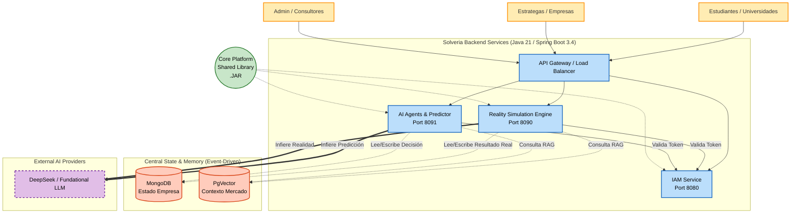

# Solveria Architecture Diagram & Service Objective

## Arquitectura de Microservicios (High-Level Diagram)

---

## Service Objectives & Data Flow

### 1. `core-platform` (Core Platform Library)
- **Objetivo:** Garantizar que todos los servicios actúen bajo las mismas reglas de arquitectura corporativa.
- **Responsabilidades:** Mutli-tenancy, logs, excepciones, trazabilidad global para todos los servicios.

### 2. `iam-service` (Identity & Access Management Service)
- **Objetivo:** Ser el único árbitro de validación de identidad y permisos, aislando esta complejidad del resto del sistema.
- **Responsabilidades:** Autenticación JWT, RBAC, gestión de Tenants y contratos Pact.

### 3. `ai-service` (AI Agents & Predictor)
- **Objetivo:** Orquestar a los agentes aislados (Finanzas, Mercado, Operaciones) conectados a DeepSeek.
- **Responsabilidades:**
  - Los agentes corporativos viven aquí. **Están asilados entre sí**, no conversan directamente.
  - Reaccionan a eventos en MongoDB (ej. "Marketing hizo un presupuesto").
  - Formulan predicciones ("Predictor Model") sobre viabilidad de estrategias usando DeepSeek.
  - Generan de forma asíncrona plantillas Excel con reportes ejecutivos usando los datos de la Base de Datos, que envían por email ante hitos importantes de la empresa.

### 4. `simulation-service` (Motor de Realidad y Eventos Aleatorios)
- **Objetivo:** Proveer la capa adversaria ("El Mercado"). No usa matemáticas duras predecibles (no Monte Carlo rígido). Usa IA conectada a Vector DBs.
- **Responsabilidades:**
  - **Dual AI Model:** Mientras que el `ai-service` intenta "Predecir" el éxito de la empresa, este servicio es el "Modelo de Realidad" aislado. Asume el rol del Mundo/Mercado.
  - Obtiene datos empíricos de **PgVector** (Costo de adquisición de clientes real, inflación, noticias).
  - Recibe la acción intencionada del usuario/agente, inyecta aleatoriedad orgánica y variables de la Vector DB mediante DeepSeek, y escribe el resultado "Real" final (Ej. Las ventas fueron menores de lo esperado) en **MongoDB**.
  - Este resultado impacta indirectamente a los Agentes del `ai-service`, cerrando el ciclo.

### Flujo Típico de Ejecución (Flow Async Aislado)
1. El Agente de **Mercado** (`ai-service`) o el usuario registra una Campaña publicitaria costosa. Esto se guarda directamente en **MongoDB**.
2. No hay comunicación directa al Agente Financiero. Sin embargo, el **Simulation Engine** (`simulation-service`) detecta esta acción en la BD.
3. El **Modelo de Realidad** (DeepSeek) hace Retrieval en **PgVector** sobre la condición actual del mercado publicitario, rechaza la suposición hiper-optimista del Predictor, y dictamina (usando IA + entropía) que la campaña atrae solo al 30% de leads.
4. El Modelo de Realidad inyecta este "Resultado Real" bajando las ventas en la BD central (Mongo).
5. Se dispara un trigger de evento de que el Flujo de Caja cayó dramáticamente.
6. El **Agente Financiero** (`ai-service`) despierta de forma aislada ante el evento, lee MongoDB, llena una plantilla `.xlsx` de estado de resultados, y envía un Email urgente al usuario: *"Alerta: Runway bajó a 2 meses debido al bajo rendimiento real de la campaña"*.
