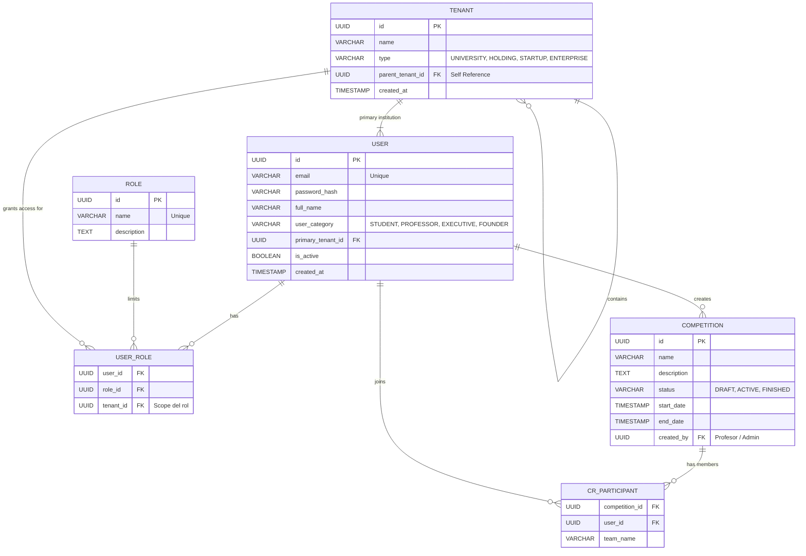

# Diseño de Base de Datos IAM (Identity & Access Management)

Este documento define el esquema relacional inicial para PostgreSQL enfocado en resolver el Login, la segregación Multi-Tenant y los distintos casos de uso del CoreSim AI (Universidades, Startups, Holdings y Competencias Cross-Institución).

## 1. Arquitectura Multi-Tenant y Categorías

El modelo se basa en un enfoque jerárquico donde la entidad principal organizativa es el `Tenant` (Institución).
Las sub-estructuras (Ej. una "Startup" incubada dentro de una "Universidad", o una "Empresa" dentro de un "Holding") se resuelven mediante un diseño recursivo en la misma tabla de Tenant (`parent_tenant_id`).

### Categorías de Organización (Tenants)
- **UNIVERSITY**: Universidades institucionales.
- **HOLDING**: Conglomerados corporativos.
- **ENTERPRISE**: Empresas tradicionales.
- **STARTUP**: Emprendimientos o células de producto.

### Categorías de Perfil de Usuario
- **STUDENT**: Alumnos que usarán la simulación en modo aprendizaje.
- **PROFESSOR**: Docentes que administran entornos de simulación y evalúan (Rúbricas).
- **FOUNDER**: Emprendedores liderando una Startup.
- **EXECUTIVE**: Tomadores de decisiones corporativas.
- **ADMIN_HOLDING**: Gestores que ven todo el panorama del Conglomerado.

## 2. Soporte a Competencias Cross-Institución

Un requisito clave de CoreSim AI es permitir que estudiantes de diferentes instituciones compitan entre sí (Ej. Simuladores Interuniversitarios).

Para resolver esto, el `User` pertenece rígidamente a un `primary_tenant_id` (su Universidad de origen). Sin embargo, se crea una entidad externa organizadora: `Competitions`. Un estudiante se enlaza a una competencia a través de relaciones Many-to-Many (`competition_participants`), lo cual autoriza temporalmente a la capa de IAM emitir un token válido para acceder a los recesos del motor de simulación asignado a ese ID de Competencia.

## 3. Diagrama Entidad Relación (ERD)



## 4. Script SQL de Inicialización (DDL)

```sql
CREATE EXTENSION IF NOT EXISTS "uuid-ossp";

-- Tablas Centrales de Organización
CREATE TABLE tenants (
    id UUID PRIMARY KEY DEFAULT uuid_generate_v4(),
    name VARCHAR(255) NOT NULL,
    type VARCHAR(50) NOT NULL CHECK (type IN ('UNIVERSITY', 'HOLDING', 'STARTUP', 'ENTERPRISE')),
    parent_tenant_id UUID REFERENCES tenants(id) ON DELETE RESTRICT,
    created_at TIMESTAMP WITH TIME ZONE DEFAULT CURRENT_TIMESTAMP
);

-- Tabla Central de Identidad (Credentials)
CREATE TABLE users (
    id UUID PRIMARY KEY DEFAULT uuid_generate_v4(),
    email VARCHAR(255) UNIQUE NOT NULL,
    password_hash VARCHAR(255) NOT NULL,
    full_name VARCHAR(255) NOT NULL,
    user_category VARCHAR(50) NOT NULL CHECK (user_category IN ('STUDENT', 'PROFESSOR', 'EXECUTIVE', 'FOUNDER', 'ADMIN_HOLDING')),
    primary_tenant_id UUID REFERENCES tenants(id) ON DELETE SET NULL,
    is_active BOOLEAN DEFAULT TRUE,
    created_at TIMESTAMP WITH TIME ZONE DEFAULT CURRENT_TIMESTAMP
);

-- Sistema RBAC (Role-Based Access Control)
CREATE TABLE roles (
    id UUID PRIMARY KEY DEFAULT uuid_generate_v4(),
    name VARCHAR(50) UNIQUE NOT NULL,
    description TEXT
);

-- Tabla pivote: Qué rol tiene el usuario y SOBRE QUÉ tenant específico aplica (Importante para Holdings)
CREATE TABLE user_roles (
    user_id UUID REFERENCES users(id) ON DELETE CASCADE,
    role_id UUID REFERENCES roles(id) ON DELETE CASCADE,
    tenant_id UUID REFERENCES tenants(id) ON DELETE CASCADE,
    PRIMARY KEY (user_id, role_id, tenant_id)
);

-- Resolutor de Competencias Inter-Institucionales
CREATE TABLE competitions (
    id UUID PRIMARY KEY DEFAULT uuid_generate_v4(),
    name VARCHAR(255) NOT NULL,
    description TEXT,
    status VARCHAR(50) NOT NULL CHECK (status IN ('DRAFT', 'ACTIVE', 'FINISHED')),
    start_date TIMESTAMP WITH TIME ZONE,
    end_date TIMESTAMP WITH TIME ZONE,
    created_by UUID REFERENCES users(id) ON DELETE SET NULL,
    created_at TIMESTAMP WITH TIME ZONE DEFAULT CURRENT_TIMESTAMP
);

CREATE TABLE competition_participants (
    competition_id UUID REFERENCES competitions(id) ON DELETE CASCADE,
    user_id UUID REFERENCES users(id) ON DELETE CASCADE,
    team_name VARCHAR(100),
    joined_at TIMESTAMP WITH TIME ZONE DEFAULT CURRENT_TIMESTAMP,
    PRIMARY KEY (competition_id, user_id)
);
```

## 5. Lógica Multi-Tenant para validación IAM Token (Oauth2/JWT)

Cuando un usuario inicia sesión (Login):

1. **Verify Identity:** `iam-service` consulta la tabla `users` mediante el email para validar credenciales (password de Bcypt o provider de SSO).
2. **Retrieve Contexts:** Ejecuta un JOIN con `user_roles` y `tenants` para saber todos los contextos organizacionales a los que este `user_id` tiene acceso según la jerarquía `parent_tenant_id`.
3. **Cross-Tenant Competitions Check:** Ejecuta un SELECT a `competition_participants` donde `status = 'ACTIVE'` para saber a qué entornos paralelos inter-universitarios está subscrito el estudiante.
4. **Issue JWT:** Genera un token JWT (ej. *Access Token*) empaquetando todo este `Authorization Payload` en los Custom Claims, previniendo viajes a la BD relacional desde los servicios de los Agentes (`ai-service`) y Motor de Realidad (`simulation-service`).
