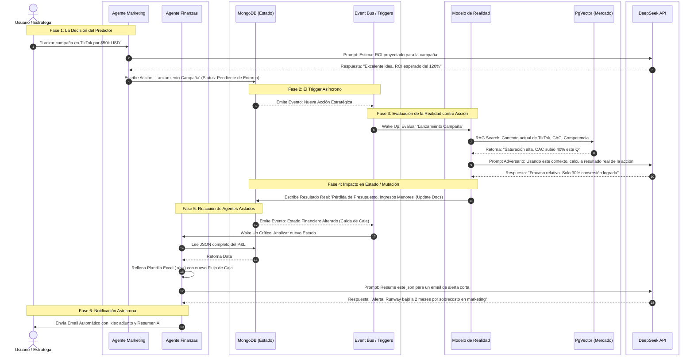

# Diagrama de Interacción Dual de IA (Flujo Basado en Eventos)

Este diagrama ilustra paso a paso cómo interactúa el bando corporativo (Agentes Predictivos) con el Mercado (Motor de Realidad) de forma totalmente asíncrona a través de un estado central (MongoDB), utilizando **DeepSeek** como motor cognitivo.

## Explicación Visual del Flujo

1. **Aislamiento Absoluto:** Observa que el *Agente de Marketing* y el *Agente de Finanzas* nunca cruzan una flecha entre sí. No se hablan por API.
2. **El "Predictor" (Mentira Corporativa):** El Agente de Marketing, usando su propio conocimiento, cree que la campaña será un existo total (Paso 3).
3. **El "Reality Engine" (El Golpe de Realidad):** Se despierta asíncronamente solo cuando hay una Inyección a la Base de Datos. Consulta su Vector DB externa y descubre que el mercado está en peores condiciones. Aplasta el hiper-optimismo de Marketing simulando métricas reales frustrantes (Paso 9).
4. **Respuesta Basada en Eventos:** Finanzas dormía hasta que el Motor de Realidad arruinó los números en la Base de Datos. Solo cuando el *Event Bus* detecta una caída de caja, Finanzas despierta para avisar al humano, generando el Excel directamente sin intervención (Paso 16 y 17).
