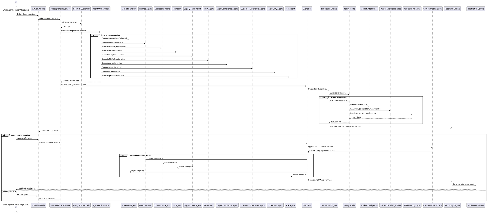

# CORESIM AI — DIAGRAMA DE SECUENCIA

**Simulador Empresarial con Agentes IA Autónomos (Startups, Productos, Holdings, Universidades)**

## 0) Propósito

Este documento define el diagrama de secuencia para **Solveria CoreSim AI**, un *Enterprise Digital Twin & Decision Lab* que permite simular decisiones estratégicas antes de ejecutarlas.

El mismo flujo se reutiliza en cuatro macro-casos de uso:
1. Simular startups completas (desde idea → go-to-market → crecimiento → crisis)
2. Simular lanzamientos de productos (pricing, demanda, supply, churn, ROI)
3. Simular creación de nuevas empresas dentro de holdings (sinergias, riesgos, capital allocation)
4. Simular competencias universitarias (modo aprendizaje, rúbricas, ranking, retroalimentación)

## 1) Principios de Arquitectura

Este diagrama asume una arquitectura moderna basada en:

- **Event-Driven Architecture (EDA)**: Todo cambio significativo se expresa como evento.
- **Multi-Agent Enterprise Network**: Agentes por dominio (HR, Legal, Ops, R&D, etc.).
- **Simulation Engine**: Escenarios + Monte Carlo + sensibilidad.
- **Reality Model**: Datos de mercado + histórico + señales externas.
- **LLM Reasoning Layer + Tools**: Predicción, explicación, recomendaciones.
- **State Store (Company Digital Twin)**: Estado empresarial versionado.
- **Governance**: Políticas, límites, auditoría, explicabilidad.

## 2) Participantes Oficiales del Diagrama

### 2.1 Actores
- **Estratega / Founder / Ejecutivo / Docente**
- **Panel de Simulación** (UI Web/Mobile)

### 2.2 Orquestación
- **Strategy Intake Service**: Captura y normaliza la decisión.
- **Agent Orchestrator**: Coordina agentes, prioridades y conflictos.
- **Policy & Guardrails**: Valida restricciones, *compliance*, b*udget caps*.

### 2.3 Agentes Empresariales (Mínimo "Fortune 500")
- Marketing Agent
- Finance Agent
- Operations Agent
- HR Agent
- Supply Chain Agent
- R&D Agent
- Legal/Compliance Agent
- Customer Experience Agent
- IT/Security Agent
- Risk Agent

### 2.4 Simulación y Realidad
- **Event Bus**: Triggers, workflows.
- **Simulation Engine**: Escenarios, Monte Carlo.
- **Reality Model**: Señales, mercado, histórico.
- **Market Intelligence**: APIs, scraping permitido, fuentes.
- **Vector Knowledge Base**: `pgvector` / Embeddings.
- **AI Reasoning Layer**: LLM (DeepSeek / OpenAI / Claude).

### 2.5 Estado y Reporting
- **Company State Store**: MongoDB / Estado + versionado.
- **Metrics & Telemetry**: KPIs, logs, trazas.
- **Reporting Engine**: Executive summary, dashboards.
- **Notification Service**: Email, WhatsApp, in-app.

---

## 3) Flujo de Secuencia

### Fase A — Propuesta y normalización de decisión
1. El Estratega define una acción (ej: “Lanzar campaña TikTok 50k”, “Lanzar producto X”, “Crear nueva empresa Y”).
2. La UI envía la acción al **Strategy Intake Service**.
3. **Policy & Guardrails** valida los límites de presupuesto, el cumplimiento legal (si aplica) y la coherencia mínima de la información.
4. Se crea el artefacto `StrategicActionProposal` con objetivo, hipótesis, horizonte temporal y restricciones.

### Fase B — Evaluación multi-agente (paralela)
1. El **Agent Orchestrator** dispara una evaluación paralela a los diferentes agentes empresariales:
   - **Marketing**: Evalúa demanda, CAC, canales.
   - **Finanzas**: Evalúa ROI, runway, NPV.
   - **Ops**: Evalúa capacidad, tiempos, cuellos de botella.
   - **HR**: Evalúa headcount, contratación, productividad.
   - **Supply**: Evalúa proveedores, lead time, inventarios.
   - **R&D**: Evalúa esfuerzo, tiempo de desarrollo.
   - **Legal**: Evalúa riesgos regulatorios.
   - **CX**: Evalúa churn, retención, reputación.
   - **IT/Sec**: Evalúa escalabilidad, riesgo cyber.
   - **Risk**: Evalúa probabilidad/impacto de fallas.
2. Cada agente produce un `AgentImpactReport` (estructurado + explicación).
3. El orquestador resuelve conflictos y consolida la información en un `UnifiedImpactModel`.

### Fase C — Activación de simulación (EDA)
1. Se publica el evento `StrategicActionCreated` en el **Event Bus**.
2. El **Simulation Engine** despierta (wake up) y crea un plan con escenarios (optimista / base / pesimista), distribución de variables y métricas objetivo.

### Fase D — Simulación avanzada (Monte Carlo + sensibilidad)
1. Para un loop N = 1000 iteraciones (Monte Carlo):
   - El **Simulation Engine** consulta al **Reality Model**.
   - El **Reality Model** obtiene señales e información de **Market Intelligence** (APIs), la **Vector Knowledge Base** (RAG) y los datos históricos (campañas previas).
   - La **AI Reasoning Layer** predice los resultados y genera explicaciones.
   - El **Simulation Engine** calcula los KPIs de esa ejecución.
2. Al finalizar, calcula la distribución del ROI, la probabilidad de éxito, el *worst-case loss* (pérdida en el peor escenario) e identifica los principales *drivers* (análisis de sensibilidad).

### Fase E — Decisión asistida (Go / No-Go / Pivot)
1. El sistema genera un **Decision Pack** con la recomendación final: `GO` / `NO-GO` / `PIVOT`. Incluye condiciones de éxito, riesgos, plan de mitigación y etapas sugeridas.
2. El Estratega revisa y decide: aprobar la acción o modificarla (feedback loop).

### Fase F — Mutación de estado (Digital Twin)
Si el Estratega aprueba la ejecución:
1. Se emite el comando `ExecuteStrategicAction`.
2. Se actualiza la base de datos **Company State Store** manteniendo un estado versionado.
3. Se publica el evento `CompanyStateChanged`.

### Fase G — Reacción autónoma de agentes
Los agentes corporativos reaccionan al escuchar `CompanyStateChanged` para reoptimizar su dominio de manera asíncrona:
- Finanzas ajusta el flujo de caja (cashflow).
- Operaciones recalcula la capacidad operativa.
- Recursos Humanos abre o pausa posiciones de contratación.
- Marketing ajusta sus tácticas y segmentación (targeting).
- Riesgo recalcula y actualiza la exposición de la compañía.

### Fase H — Reporting + Notificaciones
1. El **Reporting Engine** genera de manera automática los resúmenes ejecutivos, actualiza los dashboards y emite documentos en formatos PDF/Word.
2. El **Notification Service** empuja alertas por canales definidos (email, in-app).

---

## 4) Diagrama Oficial en PlantUML (Sequence) — Versión Enterprise

A continuación se encuentra el diagrama que modela toda la funcionalidad descrita.

---

## 5) Cómo se usa este diagrama en los 4 Macro-Casos de Uso

### 5.1 Startups completas
Los agentes priorizan el "market fit", control de *runway*, pricing y el esfuerzo de onboarding. En este escenario, entran en juego intensamente los módulos de producto, ventas, soporte y equipos de *growth*.

### 5.2 Lanzamiento de productos
Se desencadena principalmente una carga de evaluación técnica y operacional (R&D, Operaciones y Cadena de Suministro). La simulación balancea la demanda prevista con los límites operativos.

### 5.3 Nuevas empresas dentro de holdings
En corporativos grandes, los Agentes de Finanzas y Riesgo tienen la batuta analizando la colocación de capital (*capital allocation*). El Agente Legal evalúa la viabilidad multi-país y de compliance, mientras que TI valida las posibles integraciones con servicios compartidos (shared services).

### 5.4 Competencias universitarias
Se habilitan los submódulos orientados al *modo learning*. Aquí la simulación entrega métricas transformadas como *feedback explicativo*, cruza el estado frente a las rúbricas y genera un ranking entre los equipos en tiempo real.

---

## 6) Estándar de Calidad

Este diagrama está definido como **"enterprise-ready"** gracias a que incorpora orgánicamente:
- Interacciones controladas por Eventos (EDA).
- Responsabilidades delegadas a Agentes por Dominio que generan salidas de información estructurada.
- Desacoplamiento de un Motor de Simulación Independiente.
- Un Reality Model nutrido por Retrieval-Augmented Generation (RAG) y fuentes externas.
- Control del ciclo de vida de la empresa basado en Estados Versionados (el núcleo del gemelo digital).
- Funciones proactivas de Reportes Ejecutivos Auditables.

## 7) Entregables Recomendados (Next Steps)

Para completar el diseño de esta arquitectura (Paquete "MIT Level"), se deben generar posteriormente:
1. **Diagrama C4** (Contexto / Container / Componentes).
2. **Catálogo de Eventos** (Esquemas de payload y *event store*).
3. **Esquema de Estado** (Modelo subyacente del Digital Twin dentro de la base de datos).
4. **Contratos de Agentes** (Agent Contracts & Function Calling definitions).
5. **Diccionario de Métricas** (Definición formal sobre las fórmulas de los KPIs por departamento).

*Resultado:* El marco para lograr que CoreSim AI emule compañías reales usando flotas de agentes IA escalables, auditables, y preparadas para soportar ecosistemas empresariales en su totalidad.
